---

## 菜单导航与页面入口（最新）

- 共用：
  - `任务看板`（dashboard.html）
  - `存量主体管理`（subjects.html）：检索主体、进入审查、查看报告（浮窗）并支持导出（仅“已完成”）。
  - `退出登录`
- Analyst 额外：`新增主体`（analyst-new.html）
- Manager 额外：`待审核`（review.html）
- Admin 额外：`知识库模板`（admin-templates.html）

说明：`报告`菜单已移除；报告通过 `存量主体管理` 的“点击查看”进入浮窗查看并导出。

## 关键操作逻辑（更新）

### 1）同名主体校验（同地区+同名）
- 规则：只要存在状态≠“已失效”的同名主体，则禁止创建；若不存在或仅存在“已失效”，允许创建。
- 触发：`analyst-new.html` 点击“创建主体”时校验。
- 交互：弹窗展示已存在主体的基础信息【名称、ID、地点、创建时间、创建人、审查状态、风险等级】并拒绝创建。

### 2）重新发起审核（针对“已完成”主体）
- 发起：Analyst 在 `subject.html` 页面“主体详情”下方点击“重新发起审核”按钮。
- 确认弹窗：提示“重新发起审核后当前主体评级将失效，是否继续？”，支持填写申请内容。
- 消息：写入 `proto_messages` 向 Manager 发送待审批消息，内容为【发起人，申请内容】。
- 审批（Manager 在 `review.html` 消息栏）：
  - 驳回：主体状态保持不变，同时向 Analyst 发送“已驳回”消息。
  - 批准：将主体状态置为“已失效”，并向 Analyst 发送“已批准”消息，包含“更新主体信息”入口。
- 更新主体信息（Analyst）：在 `dashboard.html` 消息栏点击“更新主体信息”跳转 `analyst-new.html?cloneFrom={subjectId}`，预填以往基础信息，按新增主体流程继续；在完成前，原主体处于“已失效”且不可编辑审查清单。

### 3）报告查看与导出
- 入口：`subjects.html` 表格“报告”列点击“点击查看”打开浮窗。
- 浮窗：标题下方高亮显示主体状态；“生成报告”按钮仅在主体状态为“已完成”时可导出；未完成提示“该主体未完成风险审查”。
- 导出：实际导出使用 `report.html?subjectId=...` 进行打印（保留页面但不在侧栏展示）。

### 4）权限与只读控制
- Analyst：可编辑【结论/备注/证明文件】（仅当状态∈{未经审查, 审查中, 已退回}）；已完成显示“重新发起审核”。
- Manager：在 `review_detail.html` 执行逐项复核；在 `subject.html` 仅可查看（复核字段展示只读快照）。
- Admin：全程只读。
- 所有角色：当主体状态为“已失效”时，审查清单不可编辑。

## 数据结构与存储（localStorage）

- `proto_messages`：用于跨角色消息流转。
  - 结构：`{ id, type:'reAudit', subjectId, by, toRole:'Manager'|'Analyst', content, status:'待审批'|'已批准'|'已驳回', createdAt, meta?:{applyText} }`
  - 工具函数：`Proto.Messages.list(filter) | push(msg) | update(id, patch)`

## 流程补充

- “存量主体管理”页用于统一全库主体检索、进入审查与报告查看，提升入口一致性与可用性。

## **合规审查与风险评级系统产品需求文档 (PRD)**

| 文档版本 | V1.1027 |
| :--- | :--- |
| **创建日期** | 2025年10月25日 |
| **产品经理** | [Hanks] |
| **目标读者** | 开发团队、测试团队、项目经理、管理层 |

### **1. 项目概述**

#### **1.1 项目背景**
随着公司业务的全球化拓展，以及展业地监管要求的日趋复杂，对合作伙伴进行系统化、标准化的合规审查变得日益重要。当前，审查流程依赖人工和电子表格，效率低下、标准不一，且难以对风险进行量化比较和持续追踪。合规审查与风险评级系统为了解决这一痛点，提供一个标准化、可配置的审查处理流程与可量化的风险评估模型，为公司的业务合作决策提供高效、可靠的数据支持。

#### **1.2 产品目标**
本系统旨在将非结构化的合规要求转化为结构化、可量化的评估流程，为公司的业务合作决策提供高效、可靠的数据支持。
*   **核心目标 (V1.0)**:
    1.  实现对拟合作公司的在线合规审查。
    2.  建立一套可配置的、量化的风险评估模型。
    3.  输出标准化的、可供快速比较的风险评级报告。
    4.  规范化审查流程，实现任务的分配、流转与追踪。

#### **1.3 核心用户与角色 (User Roles)**

| 角色 | 核心职责 |
| :--- | :--- |
| **管理员 (Admin)** | 系统的维护者，负责配置和管理系统的核心规则库，更新评分表内容，包括权重、评分规则等。|
| **审查员 (Analyst)** | 尽职调查任务的主要执行者，负责一线评估工作，填写审查结论、证明文件、审查备注等。 |
| **审核经理 (Manager)** | 审查工作的复核者与决策者，对评估结果进行最终把控。 |

---

### **2. 功能需求详述 (Functional Requirements)**

#### **2.1 模块一：用户与权限管理**

*   **2.1.1 用户登录**
    *   **需求描述**: 所有用户需凭唯一的用户名和密码登录系统。
    *   **用户故事**: 作为一个用户，我希望能通过输入账号密码安全地登录系统，以便访问我权限范围内的功能。
    *   **处理逻辑**:
        *   系统校验用户输入的凭证。
        *   成功后，根据用户角色（Admin, Analyst, Manager）加载对应的界面和功能。
        *   失败则提示错误信息。

*   **2.1.2 角色权限**
    *   **需求描述**: 系统需严格区分三个角色的操作权限。
    *   **处理逻辑**:
        *   **Admin**: 拥有所有模块的完全访问权限，特别是对“知识库管理”模块的增删改查，但是对于analyst的评分结果，只能查看，不能修改，无法实际新增、修改、删除具体的主体评分。
        *   **Analyst**: 主要权限集中在“任务看板”模块，可以创建、编辑和提交自己负责的审查任务。无权访问“知识库管理”模块。
        *   **Manager**: 主要权限集中在“任务看板”模块，可以查看所有审查任务，并对“待审核”状态的任务进行“批准”或“退回”操作。无权创建或编辑任务内容。

#### **2.2 模块二：合规知识库管理 (Admin专属)**

*   **2.2.1 检查清单模板管理**
    *   **需求描述**: Admin可以创建、查看、编辑和发布不同国家/地区的检查清单模板。
    *   **用户故事**: 作为一个Admin，我需要能灵活地配置适用于不同业务场景的检查清单，以应对法规的变化。
    *   **处理逻辑**:
        *   支持创建新模板，需定义模板名称和版本号。
        *   支持编辑现有模板，模板编辑后需“发布”新版才能被审查员使用。
        *   模板列表应清晰展示模板名称、适用地区、版本号、状态（草稿/已发布/已废止）。

*   **2.2.2 审查项目配置**
    *   **需求描述**: 在每个模板下，Admin可以增删改查具体的审查项目。
    *   **处理逻辑**:
        *   新增或编辑项目时，需填写以下字段：
            *   `地区`: 国家/地区（选择）。如：HK, SG, AE, CN, US, GB。
            *   `领域`: 一级分类（文本输入/选择）。
            *   `子领域`: 二级分类（文本输入/选择）。
            *   `审查项目名称`: 审查项的具体内容（文本）。
            *   `监管依据`: 参考法规（文本）。
            *   `必填规则`: (总是必须 / 非必须 / 有条件必须) 下拉选择。
            *   `触发条件`: (当`必填规则`为`有条件必须`时出现) 定义条件。
                *   **需求描述**: Admin可为审查项设置动态的必填逻辑。例如，可设置规则为“当‘是否涉及发行业务’为‘是’时，此项为必须，如果为‘否’时，此项为非必须”。
                *   **处理逻辑**: 系统提供一个简单的规则编辑器，允许Admin选择`2.3.2`中定义的公司基本信息字段，并设置触发条件（如 等于/不等于某个值），比如“是否涉及发行业务”等于“是”时，对应的此条审查项目为必须项目。
            *   `风险等级`: (高风险/中风险/低风险) 下拉选择。
            *   `证据要求`: 证据类型（选择）。如：文档、流程图、系统截图等。
        *   系统需保存每个项目的完整信息。

#### **2.3 模块三：审查任务看板 (核心工作流模块)**

*   **2.3.1 任务列表与状态**
    *   **需求描述**: 所有角色登录后都能看到一个任务看板，以列表或卡片形式展示所有审查任务。
    *   **用户故事**: 作为一个用户，我希望一登录就能看到所有与我相关的任务及其当前状态，以便我快速定位到需要处理的工作。
    *   **处理逻辑**:
        *   任务列表需包含：公司名称、负责人(Analyst)、当前状态、更新时间。
        *   任务状态包括：
            *   **未经审查**: Analyst已创建主体，未开始审查。
            *   **审查中**: Analyst已创建主体，正在审查。
            *   **待审核**: Analyst已完成审查，等待Manager复核。
            *   **已退回**: Manager退回，等待Analyst修改。
            *   **已完成**: Manager已批准，主体归档。
        *   提供搜索和筛选功能，可按公司名称或状态进行过滤。

*   **2.3.2 创建审查主体 (Analyst专属)**
    *   **需求描述**: Analyst可以新建一个审查主体信息。
    *   **处理逻辑**:
        1.  点击“新建主体”按钮。
        2.  填写“主体名称”及其他基本信息，包括如下内容：
            1.  `主体名称`: 主体名称（文本）。
            2.  `主体注册地`: 主体注册地（选择）。
            3.  `主体成立时间`: 主体成立时间（日期）。
            4.  `主体规模`: 主体规模（选择）。
            5.  `主体联系方式`: 主体联系方式（文本）。
            6.  `主体网站`: 主体网站（文本）。
            7.  `主体邮箱`: 主体邮箱（文本）。
            8.  `主体地址`: 主体地址（文本）。
            9.  `是否涉及发行业务`: (是/否) 布尔值。
        3.  点击“创建”，系统生成主体，状态为“未经审查”，并自动跳转至主体详情页。
        4.  审查主体创建后，系统后台会根据`2.2.2`中配置的检查清单模板，结合提交的主体信息，评估知识库模板中每一项审查项目的`必填规则`，确定每个审查项目在本次审查中“是否必须”，此节点会确定下适用于该主体的所有审查项目，每一条审查项目只会对应到必须或非必须，不再会出现有条件必须的情况。此时每个主体基于admin设置的“通用审查清单”，生成了自己的“适用审查清单”，并据此进行审查和计算风险权重分。适用审查清单应该包括如下信息：
            *   `地区`
            *   `领域`
            *   `子领域`
            *   `审查项目名称`
            *   `监管依据`
            *   `必填规则`: (必须 / 非必须) 
            *   `风险等级`
            *   `风险权重分数`
                *   若 “必填规则” 为 “必须”+“风险等级” 为 “高”，权重分数 = 5
                *   若 “必填规则” 为 “非必须”+“风险等级” 为 “高”，权重分数 = 4
                *   若 “必填规则” 为 “必须”+“风险等级” 为 “中”，权重分数 = 3
                *   若 “必填规则” 为 “非必须”+“风险等级” 为 “中”，权重分数 = 2
                *   若 “必填规则” 为 “必须”+“风险等级” 为 “低”，权重分数 = 2
                *   若 “必填规则” 为 “非必须”+“风险等级” 为 “低”，权重分数 = 1

*   **2.3.3 执行审查 (Analyst专属)**
    *   **需求描述**: 在主体详情页，Analyst对每个主体进行审查。
    *   **处理逻辑**:
        *   页面按`领域` > `子领域`的结构清晰展示所有审查项目。
        *   每个项目是一个独立的操作单元，包含：
            *   **审查结论**: 下拉菜单，选项为 `符合`, `不符合`。
            *   **证明文件**: 支持上传多个文件（如PDF, DOCX, JPG）。
            *   **审查备注**: 多行文本输入框。
        *   **[核心] 实时计算**: 页面需有一个醒目的区域，根据Analyst的实时操作，即时更新并显示当前的`风险总分`和最终的`主体风险评级`。

*   **2.3.4 任务流转**
    *   **需求描述**: Analyst完成审查后提交给Manager，Manager可批准或退回。
    *   **处理逻辑**:
        *   **提交(Analyst)**: 点击“提交审核”按钮，主体状态变为`待审核`，内容锁定不可编辑。
        *   **批准(Manager)**: 在主体详情页，Manager点击“批准”，主体状态变为`已完成审查`，流程结束。
        *   **退回(Manager)**: Manager点击“退回”，需填写退回理由。主体状态变为`已退回审查`，内容解除锁定，流转回Analyst。

#### **2.4 模块四：风险评估引擎 (系统后台逻辑)**

*   **2.4.1 审查结论得分逻辑**
    *   **需求描述**: 系统需根据审查主体的具体信息，结合知识库中的`必填规则`和`风险等级`，为每个审查项目动态计算出一个本次任务专属的风险权重分。
    *   **处理逻辑**:
        *   `审查结论` = “符合” -> `得分系数` = 100%
        *   `审查结论` = “不符合” -> `得分系数` = 0%

*   **2.4.2 总分计算与评级逻辑（主体风险评级）**
    *   **需求描述**: 系统自动计算总风险分并判定主体风险评级。
    *   **处理逻辑**:
        1.  **计算适用项总权重**: `总权重分 = Σ (该主体适用审查清单中每个适用审查项目的`风险权重分`)`
        2.  **计算实际总得分**: `实际总得分 = Σ (该主体适用审查清单中每个适用审查项目的`风险权重分` * `得分系数`)`
        3.  **归一化总分**: `风险总分 = (实际总得分 / 总权重分) * 100`
        4.  **判定评级**:
            *   **高风险**: 如果`风险总分` < 80。
            *   **中风险**: 如果`风险总分` >= 80 且 < 90。
            *   **低风险**: 如果`风险总分` >= 90。

#### **2.5 模块五：报告生成**

*   **2.5.1 报告查看与导出**
    *   **需求描述**: 对于状态为“已完成”的任务，任何角色都可以查看其标准化的评估报告，并支持导出。
    *   **用户故事**: 作为一个Manager，我希望能方便地将最终的评估报告导出，用于线下汇报或归档。
    *   **处理逻辑**:
        *   系统生成一个独立的报告页面。
        *   报告内容应包括：
            *   合作方基本信息。
            *   最终风险评级和风险总分。
            *   风险概要：高亮显示所有“不符合”的项目。
            *   审查详情列表：包含每个项目的审查结论、备注和证明文件链接。
            *   操作历史：记录任务创建、提交、审核的关键时间点和人员。
        *   提供“导出为PDF”功能。

#### **2.6 系统核心流程图**

#### 2.7 详细流程图

```mermaid
---
config:
  layout: dagre
---
flowchart TB
 subgraph Admin["Admin"]
        A1["【Admin】创建模板"]
        A2["【Admin】配置适用性规则"]
        A3["【Admin】配置必填规则"]
        A4["【Admin】配置风险等级与证据要求"]
        A5["【Admin】发布模板版本"]
  end
 subgraph Analyst["Analyst"]
        B1["【Analyst】新建主体"]
        B2["【Analyst】填写主体信息"]
        P1["【系统处理】按字段选择模板与项集"]
        P2["【系统处理】评估适用性规则生成清单"]
        P3["【系统处理】评估必填规则得到必须或非必须"]
        P4["【系统处理】按必须性与风险等级计算权重"]
        B3["【Analyst】填写结论与上传证据"]
        D1{"【系统处理】分母为零"}
        P5["【系统处理】提示无法评级与处理建议"]
        P6["【系统处理】提交前校验必须项需结论与证据"]
        B4["【Analyst】提交审核"]
        B5["【Analyst】申请改配或适用性复核"]
        R1["【Analyst】更正主体信息"]
        R2["【系统处理】重算适用性与必须性与权重"]
        D3{"【系统处理】是否影响清单"}
        R3["【系统处理】展示受影响项与差异需确认"]
        R4["【Analyst】确认后更新清单与分数记录审计"]
  end
 subgraph Manager["Manager"]
        M1["【Manager】查看待审核主体"]
        M2["【Manager】审阅不符合项与证据与规则命中"]
        D2{"【Manager】是否批准"}
        M3["【Manager】退回并说明理由"]
        M4["【Manager】批准并归档"]
        M6["【Manager】审批改配或适用性复核"]
  end
    A1 --> A2
    A2 --> A3
    A3 --> A4
    A4 --> A5
    B1 --> B2
    B2 --> P1
    P1 --> P2
    P2 --> P3
    P3 --> P4
    P4 --> B3
    B3 --> D1 & B5
    D1 -- 是 --> P5
    P5 --> B2
    D1 -- 否 --> P6
    P6 -- 不通过 --> B3
    P6 -- 通过 --> B4
    M1 --> M2
    M2 --> D2
    D2 -- 否 --> M3
    M3 --> B3
    D2 -- 是 --> M4
    B5 --> M6
    M6 --> P1
    R1 --> R2
    R2 --> D3
    D3 -- 是 --> R3
    R3 --> R4
    R4 --> B3
    D3 -- 否 --> B3
    A5 --> P1
    B4 --> M1
    style A1 fill:#E6F3FF, stroke:#2E86AB, stroke-width:2px
    style A2 fill:#E6F3FF, stroke:#2E86AB, stroke-width:2px
    style A3 fill:#E6F3FF, stroke:#2E86AB, stroke-width:2px
    style A4 fill:#E6F3FF, stroke:#2E86AB, stroke-width:2px
    style A5 fill:#E6F3FF, stroke:#2E86AB, stroke-width:2px
    style B1 fill:#E6FFED, stroke:#3AA757, stroke-width:2px
    style B2 fill:#E6FFED, stroke:#3AA757, stroke-width:2px
    style P1 fill:#F5F5F5, stroke:#9E9E9E, stroke-width:2px
    style P2 fill:#F5F5F5, stroke:#9E9E9E, stroke-width:2px
    style P3 fill:#F5F5F5, stroke:#9E9E9E, stroke-width:2px
    style P4 fill:#F5F5F5, stroke:#9E9E9E, stroke-width:2px
    style B3 fill:#E6FFED, stroke:#3AA757, stroke-width:2px
    style D1 fill:#F5F5F5, stroke:#9E9E9E, stroke-width:2px
    style P5 fill:#F5F5F5, stroke:#9E9E9E, stroke-width:2px
    style P6 fill:#F5F5F5, stroke:#9E9E9E, stroke-width:2px
    style B4 fill:#E6FFED, stroke:#3AA757, stroke-width:2px
    style B5 fill:#E6FFED, stroke:#3AA757, stroke-width:2px
    style R1 fill:#E6FFED, stroke:#3AA757, stroke-width:2px
    style M1 fill:#FFF3E0, stroke:#FF9800, stroke-width:2px
    style M2 fill:#FFF3E0, stroke:#FF9800, stroke-width:2px
    style D2 fill:#FFF3E0, stroke:#FF9800, stroke-width:2px
    style M3 fill:#FFF3E0, stroke:#FF9800, stroke-width:2px
    style M4 fill:#FFF3E0, stroke:#FF9800, stroke-width:2px
    style M6 fill:#FFF3E0, stroke:#FF9800, stroke-width:2px
    style R2 fill:#F5F5F5, stroke:#9E9E9E, stroke-width:2px
    style D3 fill:#F5F5F5, stroke:#9E9E9E, stroke-width:2px
    style R3 fill:#F5F5F5, stroke:#9E9E9E, stroke-width:2px
    style R4 fill:#E6FFED, stroke:#3AA757, stroke-width:2px

```

---

---

### 香港地区规则清单（附录）

备注：本节为“香港”地区的规则数据，用于知识库模板与适用清单示例。

| 国家 / 地区 | 领域 | 子领域 | 审查项目 | 监管依据 | 是否必须 | 风险等级 |
| :-- | :-- | :-- | :-- | :-- | :-- | :-- |
| 香港 | 主体资质 | 牌照与许可 | 虚拟资产服务牌照持有情况 | 《打击洗钱及恐怖分子资金筹集条例》（第 615 章，简称 “AMLO”）第 5B 部 | 是 | 高 |
| 香港 | 主体资质 | 牌照与许可 | 牌照有效期与业务匹配度 | 《打击洗钱及恐怖分子资金筹集条例》（第 615 章）第 5B 部 | 是 | 高 |
| 香港 | 主体资质 | 牌照与许可 | 相联实体资质合规性 | 《适用于持牌法团相联实体及证监会持牌虚拟资产服务提供者的反洗钱及反恐融资指引》 | 是 | 中 |
| 香港 | 主体资质 | 牌照与许可 | 证券类业务牌照获取情况 | 《证券及期货条例》（第 571 章） | 涉及发行业务（按 “是” 认定，核心业务必需） | 高 |
| 香港 | 主体资质 | 法律主体资格 | 注册文件真实性有效性 | 《公司条例》（第 622 章） | 是 | 高 |
| 香港 | 主体资质 | 法律主体资格 | 法团注册合规性 | 《公司条例》（第 622 章） | 是 | 高 |
| 香港 | 主体资质 | 法律主体资格 | 非香港公司注册备案情况 | 无特定专项条款，参考公司注册相关通用规定 | 是 | 中 |
| 香港 | 主体资质 | 法律主体资格 | ICO 业务文件披露情况 | 无特定专项条款，参考虚拟资产监管通用要求 | 涉及发行业务（按 “是” 认定） | 高 |
| 香港 | 主体资质 | 法律主体资格 | ICO 业务代币属性明确情况 | 无特定专项条款，参考虚拟资产监管通用要求 | 涉及发行业务（按 “是” 认定） | 高 |
| 香港 | 主体资质 | 股权与控制权 | 股权结构清晰度 | 《打击洗钱及恐怖分子资金筹集条例》（第 615 章）第 53ZRQ 条 | 是 | 中 |
| 香港 | 主体资质 | 股权与控制权 | 最终拥有人身份背景合规性 | 《打击洗钱及恐怖分子资金筹集条例》（第 615 章）第 53ZRQ 条 | 是 | 高 |
| 香港 | 主体资质 | 股权与控制权 | 最终拥有人资金来源合规性 | 《打击洗钱及恐怖分子资金筹集条例》（第 615 章）第 53ZRQ 条 | 是 | 高 |
| 香港 | 主体资质 | 股权与控制权 | 规避监管持股情况 | 《打击洗钱及恐怖分子资金筹集条例》（第 615 章）第 53ZRQ 条 | 是 | 高 |
| 香港 | 主体资质 | 股权与控制权 | 跨境股权结构合规性 | 国际税收相关规则 | 否 | 中 |
| 香港 | 主体资质 | 关键人员资质 | “适当人选” 评估通过情况 | 《打击洗钱及恐怖分子资金筹集条例》（第 615 章）第 53ZRJ 条 | 是 | 高 |
| 香港 | 主体资质 | 关键人员资质 | 无犯罪记录情况 | 《打击洗钱及恐怖分子资金筹集条例》（第 615 章）第 53ZRJ 条 | 是 | 高 |
| 香港 | 主体资质 | 关键人员资质 | 专业背景合规性 | 《打击洗钱及恐怖分子资金筹集条例》（第 615 章）第 53ZRJ 条 | 是 | 高 |
| 香港 | 主体资质 | 关键人员资质 | 财务稳健性 | 《打击洗钱及恐怖分子资金筹集条例》（第 615 章）第 53ZRJ 条 | 是 | 中 |
| 香港 | 主体资质 | 关键人员资质 | 无违规破产清盘记录情况 | 《打击洗钱及恐怖分子资金筹集条例》（第 615 章）第 53ZRJ 条 | 是 | 高 |
| 香港 | 主体资质 | 关键人员资质 | 核心业务人员专业资质合规性 | 无特定专项条款，参考虚拟资产服务人员资质通用要求 | 否 | 中 |
| 香港 | 主体资质 | 关键人员资质 | 核心业务人员从业合规记录情况 | 无特定专项条款，参考虚拟资产服务人员资质通用要求 | 否 | 中 |
| 香港 | 合规体系 | 反洗钱及反恐融资（AML/CFT）制度 | AML/CFT 政策制定情况 | 《持牌法团及证监会持牌虚拟资产服务提供者指引》 | 是 | 高 |
| 香港 | 合规体系 | 反洗钱及反恐融资（AML/CFT）制度 | AML/CFT 程序制定情况 | 《持牌法团及证监会持牌虚拟资产服务提供者指引》 | 是 | 高 |
| 香港 | 合规体系 | 反洗钱及反恐融资（AML/CFT）制度 | AML/CFT 管控措施制定情况 | 《持牌法团及证监会持牌虚拟资产服务提供者指引》 | 是 | 高 |
| 香港 | 合规体系 | 反洗钱及反恐融资（AML/CFT）制度 | 全流程覆盖情况 | 《持牌法团及证监会持牌虚拟资产服务提供者指引》 | 是 | 高 |
| 香港 | 合规体系 | 反洗钱及反恐融资（AML/CFT）制度 | 加密货币交易风险识别机制建立情况 | 《持牌法团及证监会持牌虚拟资产服务提供者指引》 | 是 | 高 |
| 香港 | 合规体系 | 反洗钱及反恐融资（AML/CFT）制度 | 代币兑换风险识别机制建立情况 | 《持牌法团及证监会持牌虚拟资产服务提供者指引》 | 是 | 高 |
| 香港 | 合规体系 | 客户尽职调查流程 | 新客户个人身份验证情况 | 《持牌法团及证监会持牌虚拟资产服务提供者指引》 | 是 | 高 |
| 香港 | 合规体系 | 客户尽职调查流程 | 新客户法人身份验证情况 | 《持牌法团及证监会持牌虚拟资产服务提供者指引》 | 是 | 高 |
| 香港 | 合规体系 | 客户尽职调查流程 | 高风险客户强化尽职调查情况 | 《持牌法团及证监会持牌虚拟资产服务提供者指引》 | 是 | 高 |
| 香港 | 合规体系 | 客户尽职调查流程 | 现有客户身份信息复核情况 | 《持牌法团及证监会持牌虚拟资产服务提供者指引》 | 是 | 高 |
| 香港 | 合规体系 | 客户尽职调查流程 | 现有客户风险等级复核情况 | 《持牌法团及证监会持牌虚拟资产服务提供者指引》 | 是 | 高 |
| 香港 | 合规体系 | 客户尽职调查流程 | 休眠账户重新评估情况 | 《持牌法团及证监会持牌虚拟资产服务提供者指引》 | 否 | 中 |
| 香港 | 合规体系 | 客户尽职调查流程 | 大额交易资金来源核实情况 | 《持牌法团及证监会持牌虚拟资产服务提供者指引》 | 是 | 高 |
| 香港 | 合规体系 | 客户尽职调查流程 | 大额交易交易目的核实情况 | 《持牌法团及证监会持牌虚拟资产服务提供者指引》 | 是 | 高 |
| 香港 | 合规体系 | 客户尽职调查流程 | 跨境交易资金来源核实情况 | 《持牌法团及证监会持牌虚拟资产服务提供者指引》 | 是 | 高 |
| 香港 | 合规体系 | 客户尽职调查流程 | 跨境交易交易目的核实情况 | 《持牌法团及证监会持牌虚拟资产服务提供者指引》 | 是 | 高 |
| 香港 | 合规体系 | 可疑交易管理 | 可疑交易识别机制建立情况 | 《持牌法团及证监会持牌虚拟资产服务提供者指引》附录 B | 是 | 高 |
| 香港 | 合规体系 | 可疑交易管理 | 可疑交易及时报告情况 | 《持牌法团及证监会持牌虚拟资产服务提供者指引》 | 是 | 高 |
| 香港 | 合规体系 | 可疑交易管理 | 可疑交易记录留存情况 | 《持牌法团及证监会持牌虚拟资产服务提供者指引》 | 是 | 中 |
| 香港 | 合规体系 | 可疑交易管理 | 价格异常波动监测指标设置情况 | 《持牌法团及证监会持牌虚拟资产服务提供者指引》 | 是 | 高 |
| 香港 | 合规体系 | 可疑交易管理 | 高频交易监测指标设置情况 | 《持牌法团及证监会持牌虚拟资产服务提供者指引》 | 是 | 高 |
| 香港 | 合规体系 | 合规培训与监督 | AML/CFT 培训开展情况 | 《持牌法团及证监会持牌虚拟资产服务提供者指引》 | 是 | 中 |
| 香港 | 合规体系 | 合规培训与监督 | 虚拟资产监管法规培训开展情况 | 《持牌法团及证监会持牌虚拟资产服务提供者指引》 | 是 | 中 |
| 香港 | 合规体系 | 合规培训与监督 | 培训记录完整性 | 《持牌法团及证监会持牌虚拟资产服务提供者指引》 | 否 | 中 |
| 香港 | 合规体系 | 合规培训与监督 | 独立合规部门设立情况 | 《持牌法团及证监会持牌虚拟资产服务提供者指引》 | 是 | 高 |
| 香港 | 合规体系 | 合规培训与监督 | 合规人员权限充足性 | 《持牌法团及证监会持牌虚拟资产服务提供者指引》 | 否 | 高 |
| 香港 | 合规体系 | 合规培训与监督 | 合规人员专业能力情况 | 《持牌法团及证监会持牌虚拟资产服务提供者指引》 | 否 | 高 |
| 香港 | 合规体系 | 合规培训与监督 | 内部合规检查开展情况 | 《持牌法团及证监会持牌虚拟资产服务提供者指引》 | 是 | 中 |
| 香港 | 合规体系 | 合规培训与监督 | ICO 业务培训内容更新情况 | 《持牌法团及证监会持牌虚拟资产服务提供者指引》 | 涉及发行业务（按 “是” 认定） | 中 |
| 香港 | 合规体系 | 合规培训与监督 | 加密货币挖矿业务培训内容更新情况 | 《持牌法团及证监会持牌虚拟资产服务提供者指引》 | 否 | 中 |
| 香港 | 合规体系 | 合规培训与监督 | ICO 业务合规检查标准更新情况 | 《持牌法团及证监会持牌虚拟资产服务提供者指引》 | 涉及发行业务（按 “是” 认定） | 中 |
| 香港 | 合规体系 | 合规培训与监督 | 加密货币挖矿业务合规检查标准更新情况 | 《持牌法团及证监会持牌虚拟资产服务提供者指引》 | 否 | 中 |
| 香港 | 风险管理和内部控制 | 风险管理制度 | 全业务风险管理制度制定情况 | 《打击洗钱及恐怖分子资金筹集条例》（第 615 章）第 53ZRK 条牌照条件 | 是 | 高 |
| 香港 | 风险管理和内部控制 | 风险管理制度 | 市场风险管控流程制定情况 | 《打击洗钱及恐怖分子资金筹集条例》（第 615 章）第 53ZRK 条牌照条件 | 是 | 高 |
| 香港 | 风险管理和内部控制 | 风险管理制度 | 信用风险管控流程制定情况 | 《打击洗钱及恐怖分子资金筹集条例》（第 615 章）第 53ZRK 条牌照条件 | 是 | 中 |
| 香港 | 风险管理和内部控制 | 风险管理制度 | 操作风险管控流程制定情况 | 《打击洗钱及恐怖分子资金筹集条例》（第 615 章）第 53ZRK 条牌照条件 | 是 | 高 |
| 香港 | 风险管理和内部控制 | 风险管理制度 | 合规风险管控流程制定情况 | 《打击洗钱及恐怖分子资金筹集条例》（第 615 章）第 53ZRK 条牌照条件 | 是 | 高 |
| 香港 | 风险管理和内部控制 | 风险管理制度 | 证券型代币差异化风险管控措施制定情况 | 《打击洗钱及恐怖分子资金筹集条例》（第 615 章）第 53ZRK 条牌照条件 | 是 | 高 |
| 香港 | 风险管理和内部控制 | 风险管理制度 | 实用型代币差异化风险管控措施制定情况 | 《打击洗钱及恐怖分子资金筹集条例》（第 615 章）第 53ZRK 条牌照条件 | 是 | 中 |
| 香港 | 风险管理和内部控制 | 技术风险防控 | 技术系统合规性 | 无特定专项条款，参考行业技术标准 | 否 | 高 |
| 香港 | 风险管理和内部控制 | 技术风险防控 | 虚拟资产存储安全措施情况 | 无特定专项条款，参考行业技术安全标准 | 是 | 高 |
| 香港 | 风险管理和内部控制 | 技术风险防控 | 交易系统稳定性 | 无特定专项条款，参考行业技术标准 | 是 | 中 |
| 香港 | 风险管理和内部控制 | 技术风险防控 | 网络安全防护措施情况 | 无特定专项条款，参考行业网络安全标准 | 是 | 高 |
| 香港 | 风险管理和内部控制 | 技术风险防控 | 技术风险评估开展情况 | 无特定专项条款，参考行业技术风险管理标准 | 否 | 中 |
| 香港 | 风险管理和内部控制 | 技术风险防控 | 漏洞测试开展情况 | 无特定专项条款，参考行业技术风险管理标准 | 是 | 中 |
| 香港 | 风险管理和内部控制 | 技术风险防控 | 技术故障应急预案制定情况 | 无特定专项条款，参考行业技术应急标准 | 是 | 中 |
| 香港 | 风险管理和内部控制 | 技术风险防控 | 区块链分叉应对机制制定情况 | 无特定专项条款，参考行业技术风险应对标准 | 是 | 低 |
| 香港 | 风险管理和内部控制 | 技术风险防控 | 代币空投应对机制制定情况 | 无特定专项条款，参考行业技术风险应对标准 | 是 | 低 |
| 香港 | 风险管理和内部控制 | 客户资产保护 | 客户资产分离存放情况 | 《打击洗钱及恐怖分子资金筹集条例》（第 615 章）第 53ZRT 条 | 是 | 高 |
| 香港 | 风险管理和内部控制 | 客户资产保护 | 客户虚拟资产安全措施情况 | 《打击洗钱及恐怖分子资金筹集条例》（第 615 章）第 53ZRT 条 | 是 | 高 |
| 香港 | 风险管理和内部控制 | 客户资产保护 | 客户资产账目核对情况 | 《打击洗钱及恐怖分子资金筹集条例》（第 615 章）第 53ZRT 条 | 是 | 高 |
| 香港 | 风险管理和内部控制 | 客户资产保护 | 账目核对记录留存情况 | 《打击洗钱及恐怖分子资金筹集条例》（第 615 章）第 53ZRT 条 | 是 | 中 |
